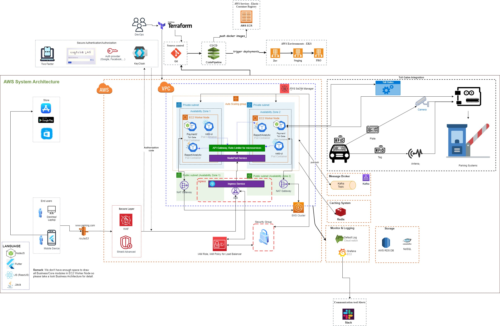
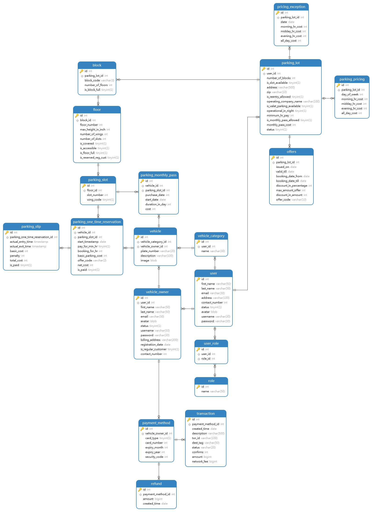

# ssa-assessment-01
Please take a look **Parking-Technical-SolutionProposal.pdf** for more details. A few images (**BUSINESS BASIC WORKFLOW**,**SYSTEM ARCHITECTURE**, **SYSTEM COMPONENTS**, **Database design diagram**)  are too small in pdf file so i added them into README file so that you can see easily.
In **Parking-Technical-SolutionProposal.pdf** file includes:
## 1. Product Requirements:
   * BUSINESS BASIC WORKFLOW - Create new parking space, payment and booking
    
   * FEATURES LIST
## 2. Technical Solution:
#### 2.1 BUSINESS ARCHITECTURE

#### 2.2 SYSTEM ARCHITECTURE - Cloud AWS

#### 2.2 SYSTEM COMPONENTS

#### 2.3 TECH STACK EVALUATION
#### 2.4 TECH-STACK
#### 2.5 SECURITY
#### 2.6 SCALABILITY/AVAILABILITY AND INTEGRATION WITH AWS CLOUD SERVICES
#### 2.7 INTEGRATION OF JAVASCRIPT FRAMEWORKS
#### 2.8 MOBILE APPLICATION - UI VISUALIZATION
#### 2.9 REPORTING AND ANALYTICS
#### 2.10 SERVER CONFIGURATION
## 3. Database design

#### 3.1 Database description
* To know more about the description of each table and column, please refer to this [link](https://dbdiagram.io/d/64c07ea702bd1c4a5eb250ae)
#### 3.2 Include table creation SQL file (park_pass_postgreql.sql)

